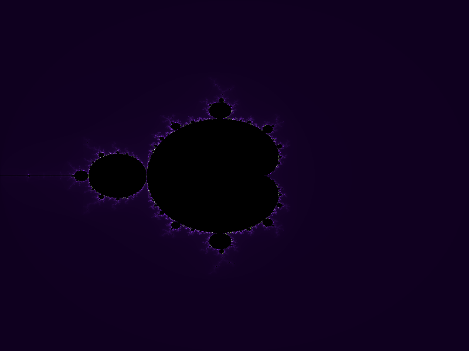
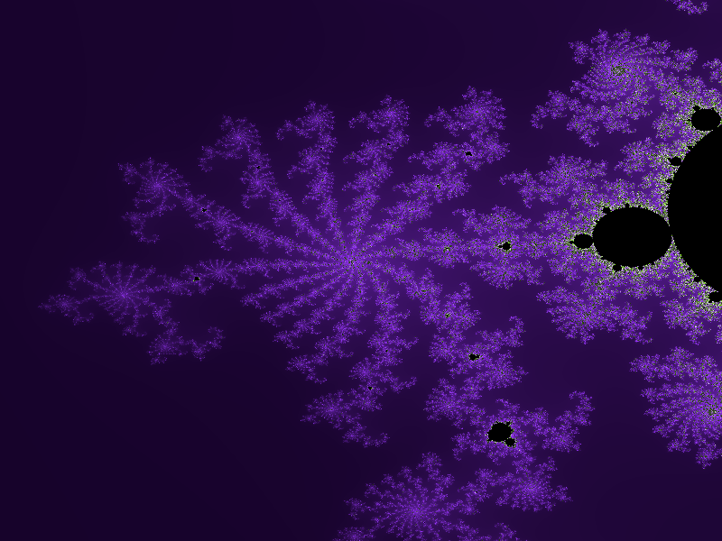
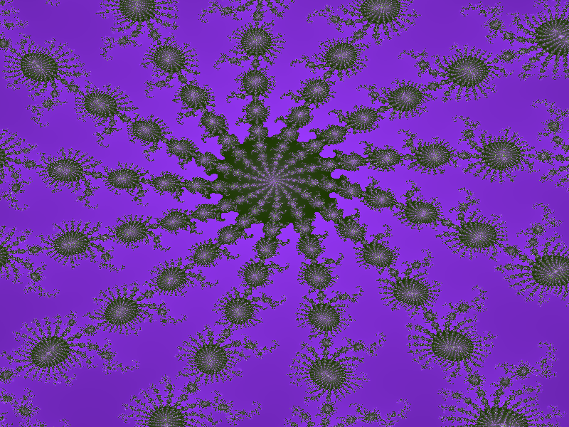
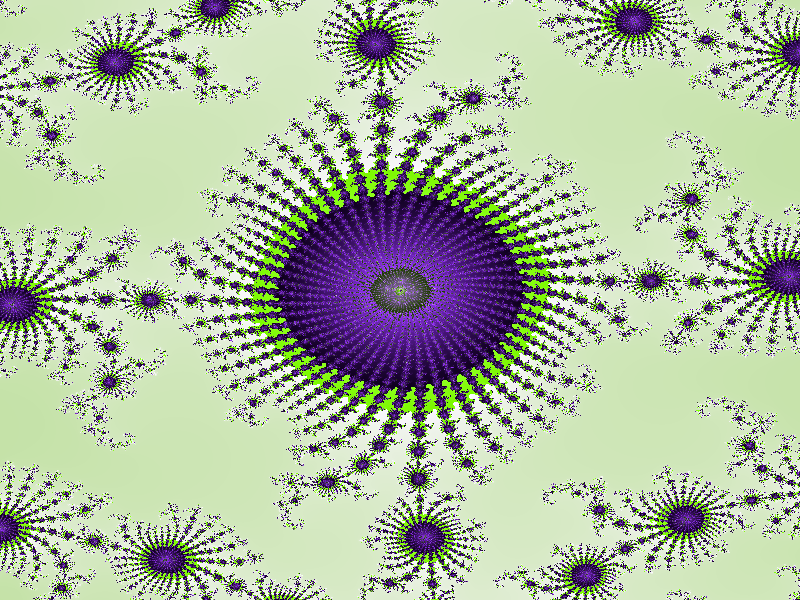
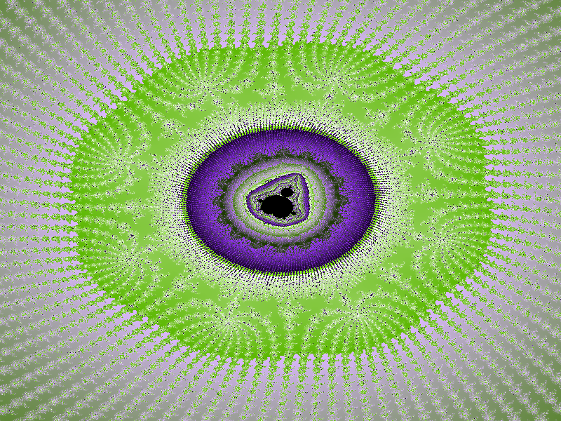

# Description
This program allows you to zoom in an arbitrary point of the Mandelbrot set. It also allows you to take screenshots.
# Compile
```shell
sudo apt-get install libsdl2-2.0 libsdl2-dev
git clone https://github.com/doubleword/mandelbrot.git
cd mandelbrot
gcc main.c rendering.c clargs.c `sdl2-config --cflags --libs` -pthread -o mandelbrot
```
# Usage
```
Usage: ./mandelbrot width height threads

width			Width of the window in pixels
height			Height of the window in pixels
threads			Amount of threads to use for rendering

Controls:

Left-click	Change the zoom point
Z			Zoom in
R			Redraw
ESC			Reset
S			Save bitmap (can be converted in a png image with the raw2png.py script)
I			Change the amount of iterations used to decide whether a point lies in the set


```
# Screenshots
By pressing the "S" key during rendering, you can dump bitmap into a file and convert it into a png image with the raw2png.py script.
raw2png.py requires Pillow:
```shell
pip install Pillow
```
## raw2png.py usage:
```
usage: raw2png.py [-h] width height file
raw2png.py: error: the following arguments are required: width, height, file

C:\Users\infop\Desktop>python raw2png.py -h
usage: raw2png.py [-h] width height file

positional arguments:
  width       width of a bitmap
  height      height of a bitmap
  file        bitmap file

optional arguments:
  -h, --help  show this help message and exit

```





